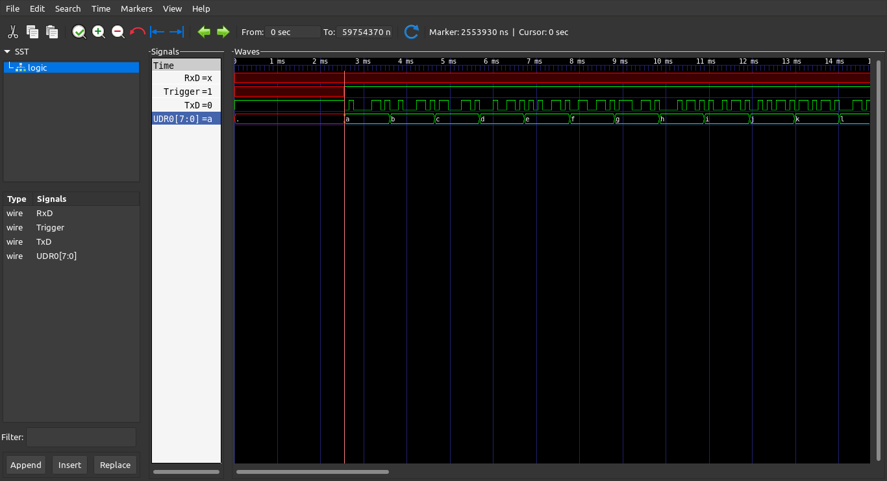

# avr-uart

A lightweight, buffered UART library for AVR microcontrollers.

## Features

- **FIFO Circular Buffers**: Efficient transmit and receive buffers with configurable sizes
- **Interrupt-Driven**: Non-blocking transmission and reception via UART interrupts
- **Pattern Matching**: Register callback functions to trigger on specific character sequences
- **STDIO Integration**: Optional stdio-style input/output
- **Flexible Configuration**: Statically (compile-time) or dynamically (runtime) configurable UART settings
- **Portable**: Port abstraction layer for different AVR variants (currently ATmega328P)

## Quick Start

```c
#include <uart.h>

int main(void) {
    uart_setup();
    
    uart_send_byte('A');
    char c = uart_recv_byte();
    
    uart_send("Hello, World!\r\n", 16);
    uart_send_int(42);
    
    return 0;
}
```

## Installation

There are two ways to use the avr-uart library in your project:

### Option 1: Use Precompiled Library

Use the API headers and link to the precompiled static library:

1. Copy `include/`, `port/` directories to your project
2. Copy `lib/libuart.a` (generated after building) to your project
3. Add include paths: `-Iinclude -Iport`
4. Link with: `-L. -luart`

```bash
# Build the library first
make build-lib

# In your project:
avr-gcc -mmcu=atmega328p -Iinclude -Iport your_main.c -L. -luart -o your_project.elf
```

This approach is simpler but you cannot customize the library features at compile time.

**Note:** To enable runtime UART configuration in the precompiled library, build with:

```bash
RUNTIMECONF=1 make build-lib
```

Then in your code:

```c
#define AVR_UART_RUNTIME_CONFIG
#include <uart.h>

struct uart_config cfg = {
    .baud_rate = 115200,
    .char_size = 8,
    .stop_bits = 1,
    .parity = UART_PARITY_NONE
};
uart_setup(&cfg);
```

### Option 2: Compile from Source

Copy the source files into your project and compile along with your code:

1. Copy `include/`, `src/`, and `port/` directories to your AVR project
2. Add `src/uart.c` and `src/match.c` (if using pattern matching) to your build
3. Configure your build system to include the appropriate include paths
4. Define feature flags (like `AVR_UART_MATCH`, `AVR_UART_STDIO`, etc.) in your build

```bash
# In your project Makefile:
CFLAGS += -I$(UART_DIR)/include -I$(UART_DIR)/port -DAVR_UART_MATCH
SRCS += $(UART_DIR)/src/uart.c $(UART_DIR)/src/match.c
```

This approach allows you to customize library features at compile time.

## Configuration

Configure the UART module using compile-time options. For feature flags (like STDIO, pattern matching, etc.), see the next section.

### Compile-Time Configuration

Define these macros in `uart_config.h` or before including `uart.h`:

| Macro | Description | Default |
|-------|-------------|---------|
| `UART_BAUD_RATE` | Baud rate (e.g., 9600, 115200) | 9600 |
| `UART_CHAR_SIZE` | Data bits (5-8) | 8 |
| `UART_STOP_BITS` | Stop bits (1 or 2) | 1 |
| `UART_PARITY` | Parity (UART_PARITY_NONE/EVEN/ODD) | UART_PARITY_NONE |
| `UART_TX_BUFFER_LEN` | TX buffer size | 64 |
| `UART_RX_BUFFER_LEN` | RX buffer size | 64 |
| `UART_MAX_SEQ_LEN` | Max pattern match length | 8 |
| `UART_MATCH_MAX` | Max number of patterns | 8 |

### Runtime Configuration

Define `AVR_UART_RUNTIME_CONFIG` before including `uart.h`:

```c
#define AVR_UART_RUNTIME_CONFIG
#include <uart.h>

int main(void) {
    struct uart_config cfg = {
        .baud_rate = 115200,
        .char_size = 8,
        .stop_bits = 1,
        .parity = UART_PARITY_NONE
    };
    
    uart_setup(&cfg);
    // ...
}
```

### Setting Feature and Compilation Flags

There are three ways to enable features and control compilation:

#### 1. Via config/config.h

Uncomment the desired definitions in `config/config.h`:

```c
/* Enable use of UART in I/O streams (stdin/stdout/stderr) */
//#define AVR_UART_IOSTREAM 1

/* Enable runtime UART configuration (call uart_setup with config struct) */
//#define AVR_UART_RUNTIME_CONFIG 1

/* Enable UART input pattern match */
//#define AVR_UART_MATCH 1

/* Use strncmp for pattern matching */
//#define AVR_UART_STRNCMP_MATCH 1

/* Emit a trigger signal that can be used by logic analyser to start capture */
//#define AVR_UART_EMIT_TRIGGER 1

/* SIM denotes that source code will compiled for simulation */
//#define AVR_UART_SIMULATION 1

/* Denotes that source code will be compiled for off-target testing */
//#define AVR_UART_SIMTEST 1

/* Demo mode with serial communication program */
//#define AVR_UART_DEMO 1

/* Enable debug build with debugging information and symbols */
//#define AVR_UART_DEBUG 1

/* Preserve compilation intermediaries */
//#define AVR_UART_SAVE_TEPMS 1

/* Set the compiler optimization level (-O0, -O1, -O2, -O3, -Os, etc.) */
//#define AVR_UART_OPTIM -Os
```

#### 2. Via Command Line

Pass flags to make:

```bash
IOSTREAM=1 make         # Enable STDIO
RUNTIMECONF=1 make      # Enable runtime configuration
MATCH=1 make            # Enable pattern matching
TRIGGER=1 make          # Enable trigger signal
SIM=1 make              # Compile for simulation
SIMTEST=1 make          # Compile for off-target testing
DEMO=1 make             # Demo mode
DEBUG=1 make            # Debug build
SAVETEMPS=1 make        # Preserve intermediate files
```

#### 3. Via Code

Define flags directly in your source code before including uart.h:

```c
#define AVR_UART_MATCH
#define AVR_UART_STDIO
#include <uart.h>
```

## API Reference

### Initialization

```c
void uart_setup();                            // Compile-time config
void uart_setup(&cfg);                        // Runtime config
```

### Sending Data

```c
void uart_send_byte(char c);                  // Send single byte (blocking)
char uart_try_send_byte(char c);              // Send single byte (non-blocking)
void uart_send(const char *str, size_t len);  // Send string
void uart_pgm_send(PGM_P str);                // Send from flash memory
void uart_send_uint(unsigned int u);          // Send unsigned int
void uart_send_int(int n);                    // Send signed int
void uart_send_float(float f, uint8_t m);     // Send float
void uart_newline(void);                      // Send CRLF
#define uart_sendln(str, len)                 // Macro: send + newline
void uart_clear(void);                        // Clear terminal screen
```

### Receiving Data

```c
char uart_recv_byte(void);                    // Receive byte (blocking)
char uart_try_recv_byte(void);                // Receive byte (non-blocking)
size_t uart_recv(char *str, size_t n);        // Receive string
char uart_peek_byte(void);                    // Peek at next byte
size_t uart_peek(char *str, size_t n);        // Peek at multiple bytes
```

### Buffer Management

```c
void uart_flush_rx(void);                     // Flush receive buffer
void uart_flush_tx(void);                     // Flush transmit buffer (waits for completion)
#define uart_flush()                          // Macro: flush both buffers
```

### Pattern Matching (Optional)

Enable with `AVR_UART_MATCH` define:

```c
void on_command(void *data) {
    uart_send("Command received!\r\n", 20);
}

int main(void) {
    uart_setup();
    uart_register_match("cmd", on_command, NULL);
    
    while (1) {
        uart_check_match();  // Process triggered patterns
    }
}
```

### Character Constants

```c
#define ascii(c)              // Convert digit to ASCII
#define c_RETURN              // Carriage return (0x0D)
#define c_NEWLINE             // Newline (0x0A)
#define c_TAB                 // Tab (0x09)
#define c_BKSPACE             // Backspace (0x08)
#define c_ESCAPE              // Escape (0x1B)
#define c_CLEARSCREEN_STRING  // ANSI clear screen
#define c_NEWLINE_STRING      // CRLF string
```

## STDIO Integration

Define `AVR_UART_STDIO` before including `uart.h` to enable stdio-style I/O:

```c
#define AVR_UART_STDIO
#include <uart.h>

int main(void) {
    uart_setup();
    
    printf("Hello via printf!\r\n");
    int c = getchar();
    putchar(c);
    
    return 0;
}
```

Or enable via build flag:

```bash
# Using command line flag
IOSTREAM=1 make

# Or uncomment in config/config.h:
# /* Enable use of UART in I/O streams (stdin/stdout/stderr) */
# //#define AVR_UART_IOSTREAM 1
```

## Building

Build can be triggered from any subdirectory in the project. The Makefiles automatically discover the project root using relative paths.

### From Project Root

```bash
make              # Build library + tests
make build-lib    # Build library only
make build-tests  # Build tests only
make clean        # Clean all
```

### From Any Subdirectory

```bash
make -C src              # Build library
cd src && make           # Or use cd

make -C tests            # Build all tests
cd tests && make         # Or use cd

make -C tests/host       # Build host tests
cd tests/host && make    # Or use cd

make -C tests/target     # Build target firmware
cd tests/target && make  # Or use cd
```

### Pattern Matching Support

```bash
make MATCH=1             # At project root
make -C src MATCH=1      # In src directory
```

### Build Targets (in tests/target)

```bash
make flash           # Flash firmware to AVR
make size            # Show memory usage
make cpp             # Preprocess only
make disasm          # Generate disassembly
make disasmall       # Generate full disassembly
make sim             # Run with simavr
make sim-gdb         # Run with simavr in GDB mode
make serial-monitor  # Open serial monitor
```

### General Targets

```bash
make help  # Show available flags
```

### Feature Flags

| Variable | Description |
|----------|-------------|
| `IOSTREAM` | Enable UART like stdin/stdout/stderr |
| `RUNTIMECONF` | Enable runtime UART configuration |
| `MATCH` | Enable UART input pattern match |
| `STRNCMP` | Use strncmp for pattern matching |
| `TRIGGER` | Emit trigger signal for logic analyzer |
| `SIM` | Compile for simulation |
| `SIMTEST` | Compile for off-target testing |
| `DEMO` | Demo mode with serial communication program |

### Compilation Variables

| Variable | Default | Description |
|----------|---------|-------------|
| `DEVICE` | atmega328p | AVR device |
| `CLOCK` | 16000000 | CPU clock frequency |
| `DEBUG` | - | Enable debug build |
| `SAVETEMPS` | - | Preserve intermediate files |
| `OPTIM` | - | Compiler optimization level |
| `RELEASE` | - | Release build |
| `INCLUDE_DIRS` | - | Include paths |

## Testing

The test strategy uses a computer host driver program and microcontroller target firmware that communicate over UART to test the library functionality.

- **Host Driver** (`tests/host/uart_test.c`): Runs on the development machine, sends commands and verifies responses
- **Target Firmware** (`tests/target/main.c`): Runs on the AVR microcontroller, responds to test commands

The host sends test data over serial, the target receives and processes it, then sends responses back to the host for verification.

### Host Driver

Run host driver on your development machine:

```bash
# Build host driver
make -C tests/host

# Or from subdirectory
cd tests/host && make

# Run with serial device
./tests/host/uart_test -d /dev/ttyUSB0

# Or use make target
make -C tests/host test_run DEVICE=/dev/ttyUSB0
```

### Target Firmware

Build and flash the target firmware to your AVR and run host tests:

```bash
# Build target firmware
make -C tests/target

# Or from subdirectory
cd tests/target && make

# Flash to AVR
make -C tests/target flash

# Or from subdirectory
cd tests/target && make flash
```

### Tests suite

The test suite consists of a bash script `run_tests` provided in the `tests` directory. It iterates through several values for baud rate, character size, stop bits and parity type; builds the firmware and flashes the target microcontroller, and then runs the host driver for each case.

See [summary](tests/tests_summary.md) of the tests.

## Simulation

The project supports simulation using [simavr](https://github.com/buserror/simavr).

### Running Simulation

```bash
# Build with SIM flag
SIM=1 make -C tests/target

# Run simulation
make -C tests/target sim

# Or run with GDB debug
make -C tests/target sim-gdb
```

### Off-Target Testing

For testing without actual hardware, use SIMTEST to compile for off-target testing:

```bash
# Build with SIMTEST flag
SIMTEST=1 make -C tests/target
```

This allows running the target firmware test program in a simulated environment using simavr's simduino board.

#### Using simduino

The simduino board emulates an Arduino board using simavr. It loads the target firmware and allows the host driver program to communicate with the emulation over a pseudoterminal device.

**Prerequisites:**
- Build simavr from source
- Note the path to the compiled simduino ELF file

**Running off-target tests:**

1. Build the target firmware with SIMTEST flag:
```bash
SIMTEST=1 make -C tests/target
```

2. Run simduino with the target firmware:
```bash
/path/to/simavr/examples/board_simduino/<simavr_build_target>/simduino.elf -v -v -v tests/target/main.hex
```
**Note:** The path to simduino.elf can vary depending on the host platform where simavr was built (uses `obj-$(shell $(CC) -dumpmachine)` format, e.g., `obj-x86_64-linux-gnu` on Debian Linux).

3. In another terminal, run the host driver:
```bash
make -C tests/host test_run DEVICE=/dev/pts/X
```

The simduino board requires the binary ihex file (not ELF). The `-v -v -v` flags enable verbose logging.

### VCD Trace Generation

When compiled with `SIM=1`, the target firmware generates VCD (Value Change Dump) files that can be viewed in GTKWave. The firmware sends a string of lowercase and uppercase English alphabets. The traces include:
- TxD (transmit signal)
- RxD (receive signal)
- Trigger signal (if enabled)
- UDR0 (UART data register)

### Viewing Simulation Results

Open the generated VCD file in GTKWave:

```bash
gtkwave simulation/atmega328p_uart_trace.vcd &
```



The waveform shows UART communication at 9600 baud with 8N1 format (8 data bits, no parity, 1 stop bit).

## Project Structure

```
avr-uart/
├── include/              # Public header files
│   ├── uart.h            # Main UART API
│   ├── uart_config.h     # Configuration definitions
│   └── match.h           # Pattern matching API
├── src/                  # Implementation
│   ├── uart.c
│   └── match.c
├── port/                 # Hardware abstraction
│   ├── port.h            # Port interface
│   └── mega328p/         # ATmega328P specific code
├── tests/                # Test applications
│   ├── host/             # Host driver program
│   │   ├── uart_test.c   # Host test driver
│   │   ├── logger.h      # Logging utilities
│   │   └── Makefile
│   └── target/           # Target firmware
│       ├── main.c        # Target test program
│       └── Makefile
├── config/               # Build configuration
├── docs/                 # Generated documentation
└── Makefile.common       # Common build definitions
```

## License

MIT License - see LICENSE file for details.

---

Documentation generated with [OpenCode](https://opencode.ai) (minimax-m2.5-free model).
